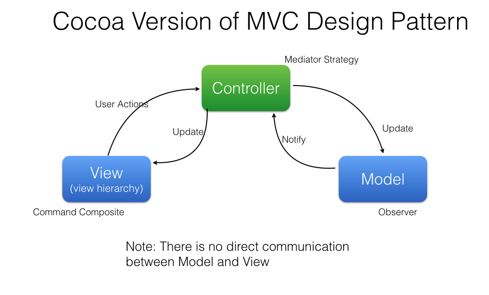

# RxMVC

Model-View-Controller pattern with [RxSwift](https://github.com/ReactiveX/RxSwift).

## Documentation

See [Wiki](https://github.com/Hardtack/RxMVC-Swift/wiki)

## Mode-View-Controller

RxMVC supports to implement Model-View-Controller pattern with RxSwift like this:

[_(from wikipedia)_](https://en.wikipedia.org/wiki/Model–view–controller)

**Not this**:

[_(from apple's document)_](https://developer.apple.com/library/mac/documentation/General/Conceptual/DevPedia-CocoaCore/MVC.html)

I don't know what the original definition is. But RxMVC is targeted to upper definition.

## Usage

To run the example project, clone the repo, and run `pod install` from the Example directory first.
